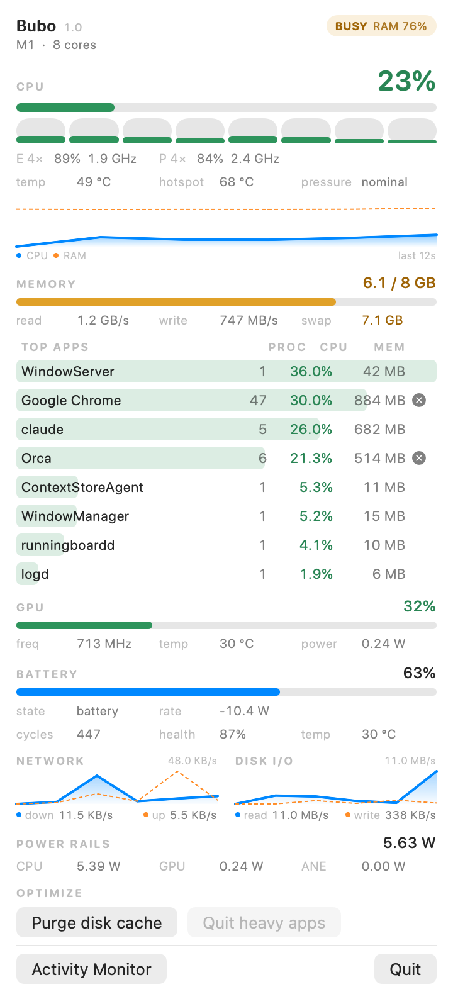
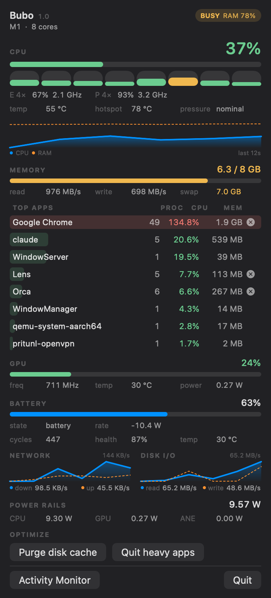
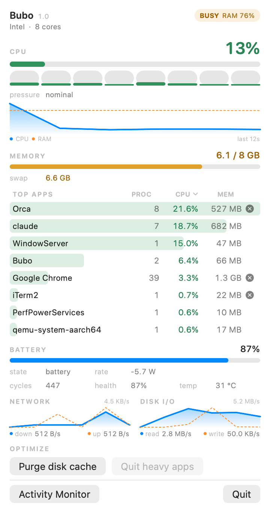
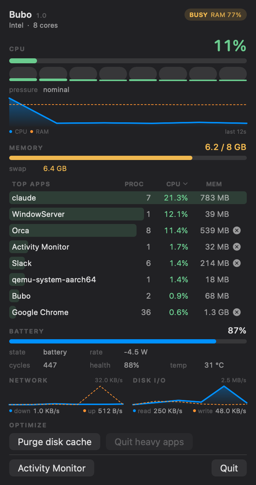

<p align="center">
  
</p>

<h1 align="center">Bubo</h1>

<p align="center">
  A tiny macOS menu-bar monitor that tells you which app is making your Mac heavy.
</p>

<p align="center">
  <sub><i>Bubo</i> is the genus of the eagle-owl: it watches all night and misses nothing.</sub>
</p>

<p align="center">
  <a href="../../releases/latest"></a>
  
  
  
</p>

<p align="center">
  
  
</p>

<p align="center">
  <sub>Light and dark. The panel follows your system appearance.</sub>
</p>

A coloured load dot sits in your menu bar. Click it for the top apps eating CPU
and memory, each with a one-click quit button, above a compact readout of the
rest: GPU, fan, battery, temperatures, power, network, and disk.

## Why

Activity Monitor lives in a window you have to open and hunt through. Bubo puts
the heaviest apps one click away in the menu bar, and quits the culprit without
opening anything else. Two Swift files and a vendored sensor layer: no Electron,
no background daemon.

## Features

| Section | What it shows |
|---|---|
| **Menu bar** | Green / yellow / red dot for overall load, plus live `CPU % · MEM %` |
| **Top apps** | The 8 heaviest processes, grouped per app, with a per-row **quit** button and a bar you can eyeball. Tap the **PROC / CPU / MEM** header to sort by that column (a ▾ marks the locked one; tap again to unlock) |
| **CPU** | Overall %, per-core bars, E / P cluster usage + frequency, average temp, die hotspot, package power |
| **Memory** | Used / total, DRAM read+write bandwidth, swap |
| **GPU** | Usage, frequency, temperature, power |
| **Fan** | Live RPM, hidden on fanless Macs |
| **Battery** | Charge %, charge/drain rate, adapter watts, cycles, health, capacity, cell temp |
| **Network / Disk** | Auto-scaled throughput (B/KB/MB per second) |
| **Power rails** | CPU · GPU · ANE · DRAM · System, whichever your chip exposes |
| **Optimize** | Purge disk cache, or quit every heavy app at once (with confirmation) |

Right-click the menu-bar item for **Open at Login**, Activity Monitor, and Quit.

Sampling runs on a background queue and the popover is built at launch, so
clicking it opens instantly.

## Apple Silicon & Intel

Each Mac gets its own native build (no Rosetta); `brew install` and the download
page pick the right one.

- **Apple Silicon** (M1–M5) — the full panel, every sensor listed above.
- **Intel** — the private power / temperature / fan / GPU / cluster / DRAM
  channels don't exist on Intel, so those panels hide and Bubo shows the
  essentials: CPU, memory, top apps, battery, network, and disk. Both builds
  follow your system appearance, light and dark.

<p align="center">
  
  
</p>

<p align="center">
  <sub>On Intel the sensor-only panels drop away — shown here light and dark.</sub>
</p>

## Install

### Homebrew

```sh
brew install fajarhide/tap/bubo
```

Homebrew installs the build matching your Mac (Apple Silicon or Intel)
automatically. Bubo is ad-hoc signed, not notarized, so the cask clears the
Gatekeeper quarantine flag on install and the app launches straight away.

### Manual

1. From the [latest release](../../releases/latest), download the `.dmg` for your
   Mac: **Bubo-apple-silicon.dmg** (M1/M2/M3…) or **Bubo-intel.dmg**.
2. Open it and drag **Bubo** into **Applications**.
3. First launch only: right-click `Bubo.app` → **Open** → **Open**.
   *(Gatekeeper asks once, since it isn't notarized.)*

Either way, right-click the menu-bar item → **Open at Login** so it's always
there. No `sudo`, no kernel extension, no login daemon.

## Build from source

Needs the Xcode command-line tools (`swiftc` and `clang`, via `xcode-select --install`).

```sh
./build.sh    # compile and install into ~/Applications (native arch)
./pack.sh     # build the shareable DMGs — one per arch
```

`mk-app.sh <dest>` is the shared compile step both scripts call.

## Cutting a release

Releases are built and published by GitHub Actions, no local build needed:

```sh
git tag v1.0 && git push origin v1.0
```

Pushing a `v*` tag runs [`.github/workflows/release.yml`](.github/workflows/release.yml),
which builds both DMGs (Apple Silicon + Intel) on an Apple Silicon runner, attaches
them to a new release, and bumps the Homebrew cask.

## How the sensors work

CPU %, memory, swap, processes, battery, network and disk I/O all use **public
macOS APIs** (`host_statistics`, `sysctl`, IOKit, `ps`) and live in
[`Sensors.swift`](Sensors.swift).

Power draw, temperatures, fan RPM, GPU usage, and DRAM bandwidth have no public
API. That layer (`IOReport` plus `AppleSMC` / `IOHIDEventSystemClient`) is
vendored unmodified from [ryyansafar/MacMonitor](https://github.com/ryyansafar/MacMonitor)
(MIT); see [`sensors/README.md`](sensors/README.md). None of it needs root. This
layer targets Apple Silicon — keys a chip doesn't expose (DRAM power and PSTR on
an M1, or every one of them on Intel) are hidden rather than printed as a fake
`0.00 W`. See [Apple Silicon & Intel](#apple-silicon--intel) for what that leaves.

## License

MIT. The vendored `sensors/` code is MIT from MacMonitor; see
[`sensors/LICENSE.MacMonitor`](sensors/LICENSE.MacMonitor).
